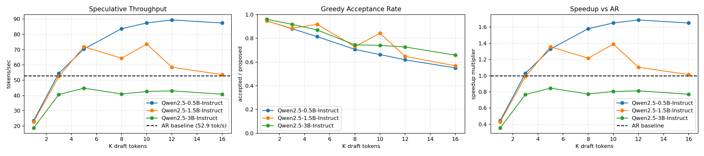

# JAX Speculative Decoding Benchmarks

Benchmark suite for testing speculative decoding with Qwen2.5 models on two GPUs.

## What This Does

- Runs a JAX autoregressive baseline with `Qwen/Qwen2.5-7B-Instruct`.
- Runs speculative decoding with a draft model on GPU 0 and target model on GPU 1.
- Sweeps draft size and draft length `K`.
- Checks that standalone speculative and scaling mode produce the same acceptance math.
- Saves JSON metrics and plots into a timestamped `results/test_*` folder.

## GPU Layout

```text
GPU 0: Qwen2.5 draft model  -> 0.5B / 1.5B / 3B
GPU 1: Qwen2.5 target model -> 7B
```

Only token IDs move between GPUs, so PCIe transfer is small compared with model compute.

## Setup

Use WSL/Linux for CUDA JAX.

```bash
cd /mnt/c/MachineLearning/UsamaKenway/jax-speculative-decoding_
python -m venv .venv
source .venv/bin/activate
python -m pip install --upgrade pip
python -m pip install -e ".[dev,jax,torch,plot]"
```

Check devices:

```bash
qwen-bench env
```

Expected:

```text
JAX backend: gpu
JAX devices: cuda:0, cuda:1
Torch CUDA devices: 2
```

## Run

Full benchmark:

```bash
cd /mnt/c/MachineLearning/UsamaKenway/jax-speculative-decoding_
source .venv/bin/activate
./scripts/run_qwen_benchmarks.sh
```

Optional custom run folder:

```bash
RUN_DIR=results/test_manual NUM_SAMPLES=8 ./scripts/run_qwen_benchmarks.sh
```

The script writes:

```text
results/test_YYYYMMDD_HHMMSS/
  env.txt
  jax_ar_7b.json
  consistency_k5_0.5b.json
  spec_k5_0.5b.json
  scaling.json
  scaling.png
  speedup.png
```

## Latest Results

Run folder:

```text
results/test_20260525_214829
```

Baseline:

```text
Qwen2.5-7B JAX autoregressive: 52.93 tokens/sec
```

Best speculative result:

```text
Draft model: Qwen2.5-0.5B-Instruct
Target model: Qwen2.5-7B-Instruct
K: 12
Throughput: 89.40 tokens/sec
Speedup: 1.69x
Acceptance rate: 0.619
```

Best result by draft model:

| Draft model | Best K | Tokens/sec | Speedup vs AR | Acceptance |
| --- | ---: | ---: | ---: | ---: |
| Qwen2.5-0.5B-Instruct | 12 | 89.40 | 1.69x | 0.619 |
| Qwen2.5-1.5B-Instruct | 10 | 73.67 | 1.39x | 0.843 |
| Qwen2.5-3B-Instruct | 5 | 44.77 | 0.85x | 0.870 |

## Plots




## Key Takeaway

The 0.5B draft model is fastest because it is cheap enough to generate draft tokens quickly. The 3B draft has higher acceptance, but its draft compute cost is too high, so it loses to the smaller draft and falls below the autoregressive baseline.


